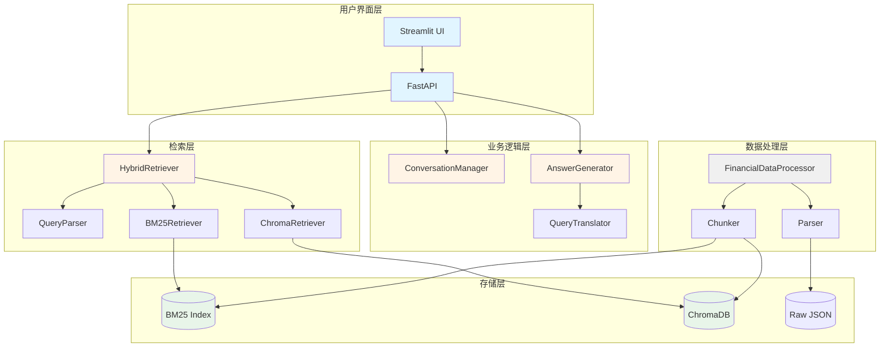
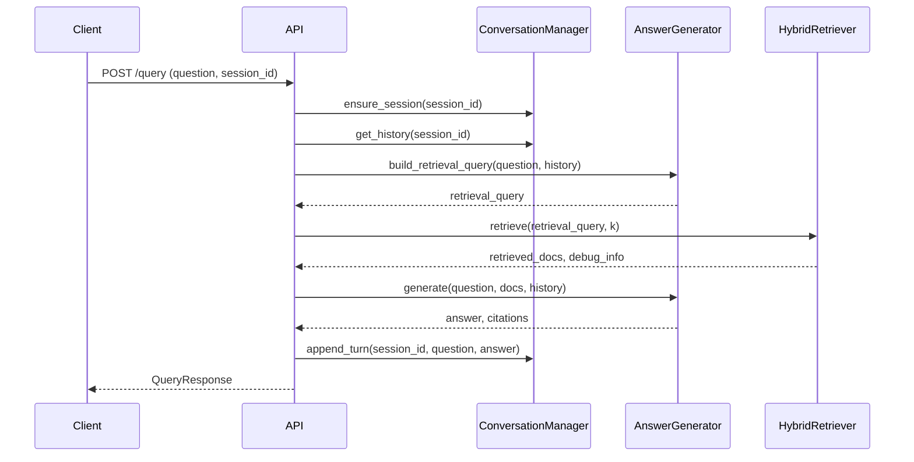
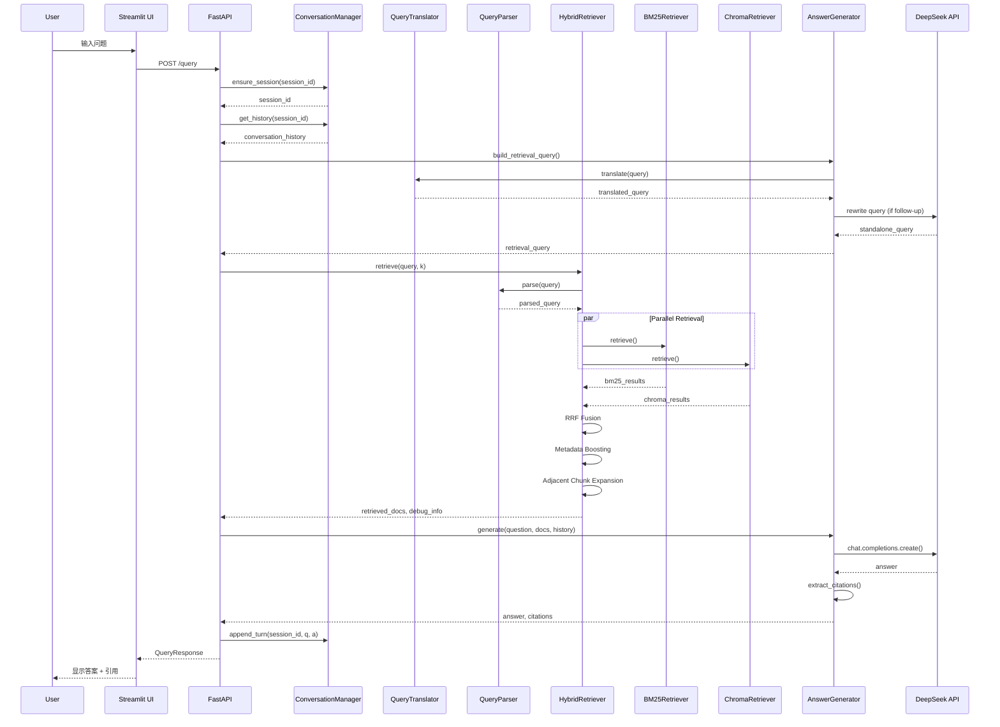

# Fin-Agent 代码库架构文档

## 项目概述

**Fin-Agent** 是一个基于 RAG（Retrieval-Augmented Generation）架构的智能问答系统，专门用于分析 Apple Inc. 的 10-K 财报文档。

### 核心价值主张

- **混合检索**：结合 BM25 关键词匹配和向量语义搜索
- **可追溯引用**：每个答案都标注来源（年份 + Section）
- **多轮对话**：支持最多保留 10 轮对话历史
- **本地部署**：所有组件均可本地运行

---

## 技术栈

| 层级 | 技术选型 | 版本 |
|------|----------|------|
| **应用框架** | FastAPI | 0.109.0+ |
| **前端界面** | Streamlit | 1.31.0+ |
| **向量数据库** | ChromaDB | 0.5.0+ |
| **Embedding 模型** | bge-small-en-v1.5 | - |
| **关键词检索** | bm25s | 0.1.6+ |
| **LLM** | DeepSeek API / Ollama | - |
| **数据模型** | Pydantic | 2.5.3+ |
| **配置管理** | pydantic-settings | 2.1.0+ |
| **日志** | loguru | 0.7.2+ |

---

## 系统架构图



---

## 目录结构

```
fin-agent/
├── app/
│   ├── api/                    # FastAPI 路由层
│   │   └── main.py            # API 端点定义
│   ├── core/                   # 核心配置
│   │   ├── config.py          # 全局配置管理（Settings）
│   │   └── conversation.py    # 对话状态管理
│   ├── ingest/                 # 数据摄取层
│   │   ├── parser.py          # JSON 解析器
│   │   ├── preprocessor.py    # 数据预处理器
│   │   └── chunker.py         # 文本分块器
│   ├── retrieve/               # 检索层
│   │   ├── bm25_retriever.py  # BM25 关键词检索
│   │   ├── chroma_retriever.py # 向量语义检索
│   │   └── hybrid_retriever.py # 混合检索器
│   ├── generate/               # 生成层
│   │   └── answer_generator.py # LLM 答案生成器
│   ├── schemas/                # 数据模型
│   │   └── models.py          # Pydantic 模型定义
│   └── eval/                   # 评估模块
│       └── ragas_evaluator.py # RAGAS 评估器
├── ui/
│   └── streamlit_app.py       # Streamlit 前端界面
├── data/
│   ├── raw/                   # 原始数据（aapl_10k.json）
│   ├── processed/             # 处理后的数据
│   ├── bm25_index/            # BM25 索引
│   └── chroma_db/             # ChromaDB 持久化存储
├── scripts/                   # 工具脚本
│   ├── setup.py              # 初始化脚本
│   ├── build_index.py        # 构建索引
│   ├── debug_retrieve.py     # 检索调试工具
│   ├── debug_answer.py       # 问答调试工具
│   └── eval.py               # 评估脚本
├── requirements.txt
├── Dockerfile
└── docker-compose.yml
```

---

## 核心模块详解

### 1. 配置管理模块 (`app/core/config.py`)

**职责**：集中管理所有配置参数

**核心类**：`Settings(BaseSettings)`

**主要配置项**：
```python
# LLM 配置
llm_provider: Literal["deepseek", "ollama"]
deepseek_api_key: str
deepseek_base_url: str
ollama_base_url: str
ollama_model: str

# Embedding 配置
embedding_model: str  # BAAI/bge-small-en-v1.5
embedding_device: str  # cpu/cuda/mps

# 检索配置
bm25_top_k: int
vector_top_k: int
final_top_k: int
chunk_size: int       # 512
chunk_overlap: int    # 50
table_chunk_size: int # 1536

# 对话配置
conversation_window_size: int  # 10

# API 配置
api_host: str
api_port: int

# 路径配置
data_raw_path: str
data_processed_path: str
chroma_persist_dir: str
```

---

### 2. 对话管理模块 (`app/core/conversation.py`)

**职责**：管理多轮对话状态

**核心类**：`ConversationManager`

**关键方法**：
- `create_session()` - 创建新会话
- `ensure_session(session_id)` - 确保会话存在
- `get_history(session_id)` - 获取对话历史
- `append_turn(session_id, question, answer)` - 添加新对话轮次

**数据结构**：
```python
class ConversationTurn(BaseModel):
    question: str
    answer: str
```

**实现细节**：
- 使用 `deque(maxlen=10)` 自动保留最近 10 轮对话
- 使用 `threading.Lock` 保证线程安全
- 每个会话使用 `uuid4().hex` 生成唯一标识

---

### 3. 检索层模块 (`app/retrieve/`)

#### 3.1 混合检索器 (`hybrid_retriever.py`)

**核心类**：`HybridRetriever`

**工作流程**：
```
用户查询
    ↓
QueryParser（解析查询约束）
    ↓
并行检索
    ├─ BM25Retriever（关键词匹配）
    └─ ChromaRetriever（向量搜索）
    ↓
RRF Fusion（倒序排名融合）
    ↓
Metadata Boosting（元数据增强）
    ↓
Adjacent Chunk Expansion（邻接块扩展）
    ↓
最终结果
```

**QueryParser 功能**：
- 年份提取（`2023`, `2024`...）
- 查询类型识别（`factual`, `comparative`, `summary`）
- 主题分类（`risk_factors`, `md&a`, `financial_statements`, `business`）
- 查询规范化（别名处理：`appl` → `apple`）
- 特殊提示检测（如 `cash_flow`）

**RRF 融合算法**：
```python
rrf_score = k / (k + rank + 1)  # k = 60
```

**元数据增强策略**：
- 年份精确匹配：`boost *= 1.2`
- 主题类型匹配：`boost *= 1.35`
- 表格数据（事实查询）：`boost *= 1.1`
- 现金流表特殊处理：`boost *= 2.0`
- Reserved 内容降权：`boost *= 0.2`

**邻接块扩展**：
- 当查询命中 `Cash Flow Statement` 时
- 自动加载同一文档的相邻 chunk
- 使用距离衰减公式：`decay = max(0.7, 1.0 - distance * 0.08)`

#### 3.2 BM25 检索器 (`bm25_retriever.py`)

**特点**：
- 使用 `bm25s` 库实现
- 支持年份和元数据过滤
- 基于 `rank-bm25` 算法

**索引结构**：
```python
{
    "corpus": [chunk_data, ...],
    "bm25_index": BM25Index object
}
```

#### 3.3 向量检索器 (`chroma_retriever.py`)

**特点**：
- 使用 ChromaDB 作为向量数据库
- 使用 `bge-small-en-v1.5` 作为 embedding 模型
- 支持元数据过滤

---

### 4. 生成层模块 (`app/generate/answer_generator.py`)

**核心类**：`AnswerGenerator`

**主要组件**：

#### 4.1 PromptTemplate

针对不同查询类型的提示模板：
- `SYSTEM_TEMPLATE` - 系统角色定义
- `FACTUAL_TEMPLATE` - 事实查询
- `COMPARATIVE_TEMPLATE` - 对比分析
- `SUMMARY_TEMPLATE` - 综合总结
- `QUERY_REWRITE_TEMPLATE` - 查询重写

#### 4.2 QueryTranslator

**功能**：将中文查询翻译为英文以提升检索效果

**翻译 Prompt**：
```python
"""Translate the following Chinese financial question to English.
Keep technical terms accurate (e.g., "risk factors", "revenue", "net income")."""
```

#### 4.3 AnswerGenerator 核心方法

**`generate()`** - 生成答案主方法：
```python
def generate(
    question: str,
    retrieved_docs: List[RetrievedDocument],
    query_type: str = "factual",
    debug_info: Dict[str, Any] = None,
    conversation_history: Optional[List[ConversationTurn]] = None,
) -> tuple[str, List[Citation]]
```

**`build_retrieval_query()`** - 构建检索查询：
- 检测是否为追问（`_looks_like_follow_up()`）
- 使用 LLM 重写查询（如果可用）
- 结合对话历史生成独立查询

**追问检测模式**：
```python
follow_up_patterns = [
    r"\b(what about|how about|and what|and how|same for)\b",
    r"(那|那么|这个|这个呢|那个|那个呢|它|它们|还有呢)"
]
```

---

### 5. 数据模型模块 (`app/schemas/models.py`)

**核心数据模型**：

```python
# 文档块
class DocumentChunk(BaseModel):
    doc_id: str              # {year}_{section_id}
    symbol: str              # AAPL
    year: int
    form_type: str           # 10-K
    section_id: str
    section_title: str
    item_type: str
    text: str
    chunk_id: int
    metadata: Dict[str, Any]

# 检索结果
class RetrievedDocument(BaseModel):
    doc_id: str
    text: str
    score: float
    metadata: Dict[str, Any]
    retrieval_method: str    # 'bm25', 'vector', 'hybrid'

# API 请求/响应
class QueryRequest(BaseModel):
    question: str
    max_results: int = 5
    include_citations: bool = True
    session_id: Optional[str] = None

class QueryResponse(BaseModel):
    session_id: str
    answer: str
    citations: List[Citation]
    conversation_history: List[ConversationTurn]
    retrieval_debug: Optional[Dict[str, Any]]

# 引用
class Citation(BaseModel):
    year: int
    section_title: str
    chunk_id: str
    relevance_score: float
```

---

### 6. API 层模块 (`app/api/main.py`)

**FastAPI 应用架构**：

**核心端点**：

| 端点 | 方法 | 功能 |
|------|------|------|
| `/` | GET | API 根路径 |
| `/health` | GET | 健康检查 |
| `/index/status` | GET | 索引状态查询 |
| `/index/build` | POST | 构建索引 |
| `/query` | POST | 问答查询 |
| `/report` | POST | 生成报告 |

**生命周期管理**：
```python
@asynccontextmanager
async def lifespan(app: FastAPI):
    # Startup: 初始化所有组件
    components["bm25_retriever"] = BM25Retriever()
    components["chroma_retriever"] = ChromaRetriever()
    components["answer_generator"] = AnswerGenerator()
    components["conversation_manager"] = ConversationManager()
    components["hybrid_retriever"] = HybridRetriever(...)
    yield
    # Shutdown: 清理资源
```

**`/query` 端点处理流程**：


---

### 7. 前端界面 (`ui/streamlit_app.py`)

**Streamlit 应用架构**：

**主要组件**：
- `init_session_state()` - 初始化会话状态
- `load_system_components()` - 加载检索器和生成器
- `render_header()` - 渲染页面头部
- `render_sidebar()` - 渲染设置侧边栏
- `render_conversation()` - 渲染对话历史
- `render_citations()` - 渲染引用列表
- `render_debug_info()` - 渲染调试信息

**侧边栏设置**：
- Top K Results (3-10)
- Use Hybrid Retrieval
- Year Filter (None/2020-2025)
- LLM Provider (deepseek/ollama)
- Clear Conversation 按钮

**示例查询**：
- "2025 Risks"
- "Revenue Trend"
- "Business Overview"
- "Financial Health"
- "Legal Issues"
- "R&D Investment"

---

## 数据流图

### 完整问答流程



---

## 设计模式分析

### 1. 策略模式 (Strategy Pattern)

**应用场景**：不同查询类型的答案生成策略

```python
# app/generate/answer_generator.py
if query_type == "comparative":
    prompt = self.templates.COMPARATIVE_TEMPLATE
elif query_type == "summary":
    prompt = self.templates.SUMMARY_TEMPLATE
else:
    prompt = self.templates.FACTUAL_TEMPLATE
```

### 2. 建造者模式 (Builder Pattern)

**应用场景**：Prompt 构建和上下文组装

```python
# app/generate/answer_generator.py
def _build_context(self, docs: List[RetrievedDocument]) -> str:
    context_parts = []
    for i, doc in enumerate(docs, 1):
        source = f"[{i}] Year: {metadata.get('year')}, ..."
        text = doc.text[:1000] + "..." if len(doc.text) > 1000 else doc.text
        context_parts.append(f"{source}\n{text}")
    return "\n\n".join(context_parts)
```

### 3. 单例模式 (Singleton Pattern)

**应用场景**：全局配置和组件实例

```python
# app/core/config.py
settings = Settings()  # 全局单例

# app/api/main.py
components: Dict[str, Any] = {}  # 全局组件容器
```

### 4. 命令模式 (Command Pattern)

**应用场景**：API 端点封装

```python
# app/api/main.py
@app.post("/query", response_model=QueryResponse)
async def query(request: QueryRequest):
    # 命令执行
    ...
```

### 5. 观察者模式 (Observer Pattern)

**应用场景**：对话历史更新（隐式）

```python
# app/core/conversation.py
def append_turn(self, session_id: str, question: str, answer: str):
    # 更新对话历史
    self._sessions[session_id].append(turn)
    # 返回更新后的历史
    return list(self._sessions[session_id])
```

---

## 性能优化策略

### 1. 检索层优化

- **并行检索**：BM25 和向量检索并行执行
- **RRF 融合**：高效的倒序排名融合算法
- **邻接块扩展**：仅在特定场景下启用（如现金流查询）

### 2. 生成层优化

- **查询重写缓存**：可扩展为缓存重写后的查询
- **上下文截断**：限制每个文档片段为 1000 字符
- **对话窗口限制**：最多保留 10 轮对话历史

### 3. 存储层优化

- **ChromaDB 持久化**：向量索引持久化到磁盘
- **BM25 内存索引**：快速加载和检索

---

## 扩展性设计

### 1. 检索器扩展

通过 `HybridRetriever` 可以轻松添加新的检索器：

```python
class NewRetriever:
    def retrieve(self, query: str, k: int) -> List[RetrievedDocument]:
        ...

# 在 HybridRetriever 中集成
class HybridRetriever:
    def __init__(self, ...):
        self.new_retriever = NewRetriever()

    def retrieve(self, ...):
        new_results = self.new_retriever.retrieve(...)
        # 融合新结果
```

### 2. LLM 提供商扩展

通过配置轻松切换 LLM 提供商：

```python
# .env
LLM_PROVIDER=ollama  # 或 deepseek
OLLAMA_BASE_URL=http://localhost:11434
OLLAMA_MODEL=deepseek-coder:33b
```

### 3. 文档类型扩展

系统设计支持扩展到其他文档类型（如 10-Q、其他公司 10-K）：

```python
# app/schemas/models.py
class DocumentChunk(BaseModel):
    symbol: str  # 支持不同股票代码
    form_type: str  # 支持 10-K, 10-Q 等
    ...
```

---

## 安全考虑

### 1. 输入验证

使用 Pydantic 模型自动验证所有输入：

```python
class QueryRequest(BaseModel):
    question: str = Field(description="User question")
    max_results: int = Field(default=5, ge=1, le=20)
```

### 2. API 密钥管理

通过环境变量管理敏感信息：

```python
deepseek_api_key: str = Field(default="")
```

### 3. 并发控制

使用 `threading.Lock` 保护共享状态：

```python
class ConversationManager:
    def __init__(self):
        self._lock = Lock()

    def append_turn(self, ...):
        with self._lock:
            self._sessions[session_id].append(turn)
```

---

## 测试策略

### 1. 单元测试

- 测试各个检索器的独立功能
- 测试查询解析器
- 测试答案生成器

### 2. 集成测试

- 测试完整的问答流程
- 测试多轮对话
- 测试 API 端点

### 3. 评估测试

使用 RAGAS 框架进行系统评估：

```bash
./venv/bin/python scripts/eval.py --metrics hit_rate mrr faithfulness
```

**评估指标**：
- **Hit Rate**：相关文档是否在 Top K 结果中
- **MRR**：平均倒数排名
- **Faithfulness**：答案是否基于检索到的证据

---

## 部署架构

### Docker 部署

```yaml
# docker-compose.yml
services:
  app:
    build: .
    ports:
      - "8501:8501"  # Streamlit UI
      - "8000:8000"  # FastAPI
    volumes:
      - ./data:/app/data
    environment:
      - DEEPSEEK_API_KEY=${DEEPSEEK_API_KEY}
```

### 环境变量配置

```bash
# .env
LLM_PROVIDER=deepseek
DEEPSEEK_API_KEY=your_api_key
EMBEDDING_MODEL=BAAI/bge-small-en-v1.5
EMBEDDING_DEVICE=cpu
CHUNK_SIZE=512
CHUNK_OVERLAP=50
TABLE_CHUNK_SIZE=1536
CONVERSATION_WINDOW_SIZE=10
```

---

## 故障排查指南

### 检索结果不准确

1. 检查 BM25 索引是否已构建
2. 检查 ChromaDB 集合是否存在
3. 尝试调整 Top K 参数
4. 查看调试信息中的 `query_type` 和 `filters_applied`

### LLM 回答错误

1. 检查检索到的文档是否相关
2. 查看调试信息中的 `retrieved_docs`
3. 尝试调整 Prompt 模板
4. 检查 API 密钥是否有效

### 表格数据不完整

1. 检查邻接块扩展是否启用
2. 调整 `TABLE_CHUNK_SIZE` 参数
3. 检查 `TABLE_HEADER_LINES` 设置

---

## 未来改进方向

### 1. 检索增强

- [ ] 引入重排序模型（Reranker）
- [ ] 实现查询扩展
- [ ] 支持更复杂的过滤条件

### 2. 评估体系

- [ ] 建立完整的 RAG 评估指标
- [ ] 添加用户反馈机制
- [ ] A/B 测试框架

### 3. 功能扩展

- [ ] 支持 SEC 文件在线下载
- [ ] 添加更多公司（不仅 AAPL）
- [ ] 图表可视化（营收趋势、风险变化）
- [ ] 支持多语言

---

## 参考资源

- **RAGAS 评估框架**：https://docs.ragas.io/
- **ChromaDB 文档**：https://docs.trychroma.com/
- **bge-small-en-v1.5**：https://huggingface.co/BAAI/bge-small-en-v1.5
- **DeepSeek API**：https://platform.deepseek.com/

---

**文档版本**：1.0
**最后更新**：2026-03-28
