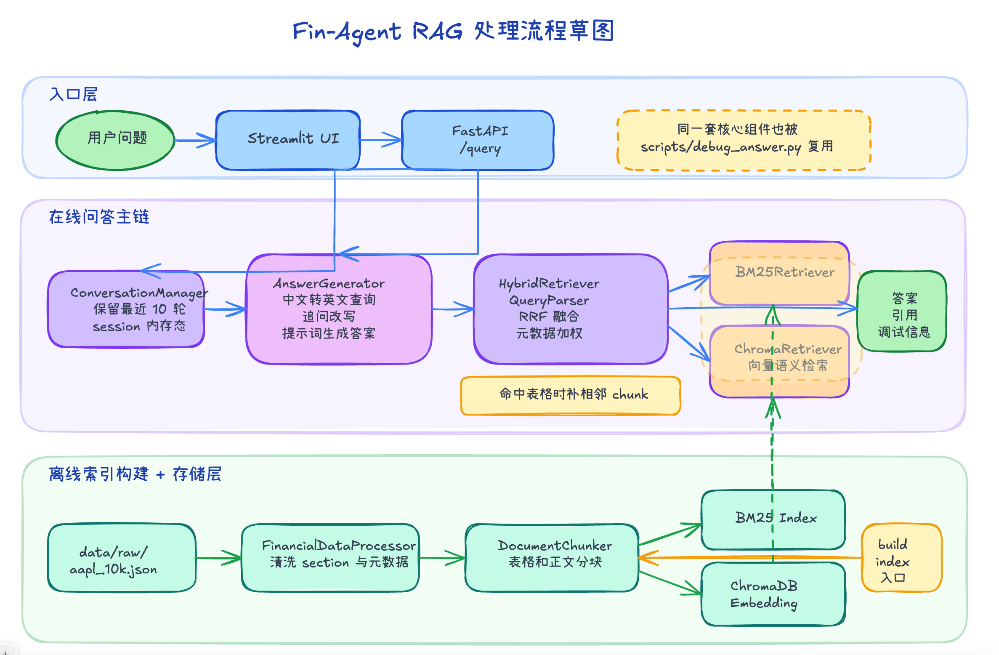
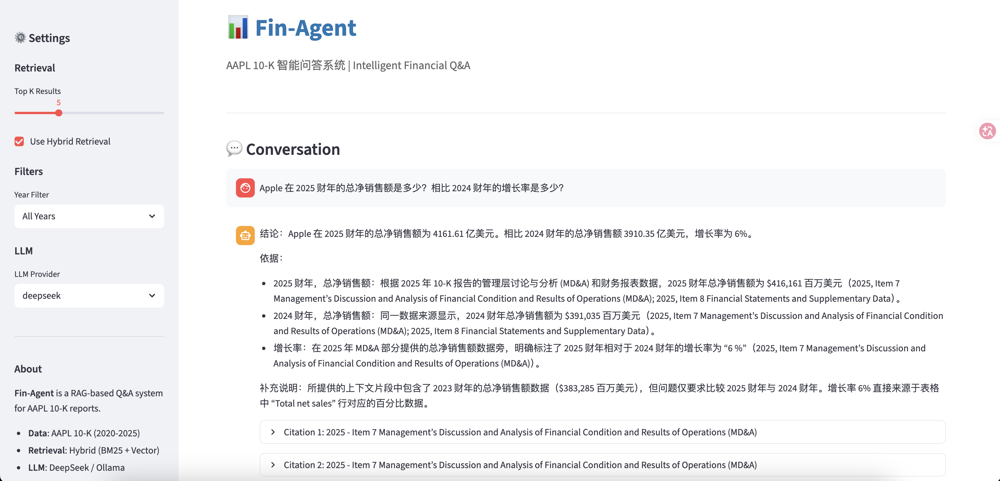

# 📊 Fin-Agent - AAPL 10-K 智能问答与可视化系统

> 基于 RAG 架构的 Apple 10-K 财报智能分析系统

## 📚 目录

- [项目简介](#project-overview)
- [技术架构](#architecture)
- [快速开始](#quick-start)
- [使用指南](#usage-guide)
- [项目结构](#project-structure)
- [配置说明](#configuration)
- [评估指南](#evaluation)
- [AI 协作说明](#ai-collaboration)
- [常见问题](#faq)
- [开发路线](#roadmap)
- [版本历史](#version-history)
- [许可证](#license)
- [致谢](#acknowledgements)

<a id="project-overview"></a>

## 🎯 项目简介

Fin-Agent 是一个专门用于分析 Apple Inc. 10-K 财报的智能问答与可视化系统。通过混合检索（BM25 + 向量搜索）、多轮对话管理、多智能体可视化流水线和大语言模型，系统能够回答关于 Apple 财务状况、风险因素、业务表现等问题，并支持从财报文本中提取结构化数据生成交互式图表。

### 解决的问题

- **10-K 报告难懂**：动辄数百页的财报，信息密度高，难以快速定位关键信息
- **数据追溯困难**：传统搜索无法关联不同年份的数据变化
- **专业门槛高**：财务术语和表格需要专业知识才能理解

### 系统特点

- ✅ **混合检索**：结合 BM25 关键词匹配和向量语义搜索
- ✅ **可追溯引用**：每个答案都标注来源（年份 + Section）
- ✅ **跨年分析**：支持对比不同年份的数据变化
- ✅ **多轮对话**：按会话保留最近 10 轮问答上下文
- ✅ **数据可视化**：支持生成营收、利润、现金流等 Plotly 图表
- ✅ **多入口验证**：支持 Streamlit UI、FastAPI API 与本地 CLI 调试
- ✅ **本地优先**：检索、问答、UI、API 和调试脚本都可本地运行
- ✅ **容器化**：Docker 一键部署开箱即用

---

<a id="architecture"></a>
## 🏗️ 技术架构

### 系统架构图

**Excalidraw 草图**


**处理流程摘要**

1. 离线构建阶段：`data/raw/aapl_10k.json` 经过 `FinancialDataProcessor` 清洗和 `DocumentChunker` 分块，分别写入 `BM25 Index` 与 `ChromaDB`。
2. 在线问答阶段：用户从 Streamlit 或 FastAPI 进入后，`ConversationManager` 先恢复最近 10 轮上下文。
3. 问答链路中，`AnswerGenerator` 负责中文查询翻译、追问改写，然后把检索查询交给 `HybridRetriever`。
4. 可视化链路中，`VisualizationAgent` 会复用 `HybridRetriever`，再串联 `DataExtractor` 和 `ChartGenerator` 生成图表与分析文本。
5. `HybridRetriever` 内部先做 `QueryParser` 解析，再分别走 `BM25Retriever` 和 `ChromaRetriever`，最后做 RRF 融合、元数据加权和现金流表相邻 chunk 扩展。
6. 问答结果会返回答案与引用；可视化结果会返回图表 HTML / JSON、分析文本与引用。

```
用户问题
    ↓
[Query Parser] → 提取年份/主题/问题类型
    ↓
[Hybrid Retriever]
    ├─ BM25 Retriever (关键词精确匹配)
    └─ Chroma Retriever (向量语义搜索)
    ↓
[Conversation Window] → 保留最近 10 轮问答
    ↓
[RRF Fusion] → 合并去重 → 规则重排序
    ↓
[Answer Generator / VisualizationAgent]
    ↓
[Streamlit UI / FastAPI] → 展示答案、图表、引用、调试信息
```

### 技术栈

| 组件 | 技术选型 | 说明 |
|------|----------|------|
| **向量存储** | ChromaDB | 轻量级本地向量数据库 |
| **Embedding** | bge-small-en-v1.5 | 英文金融文本语义编码 |
| **关键词检索** | bm25s | BM25 算法实现 |
| **结果融合** | RRF | Reciprocal Rank Fusion |
| **LLM** | DeepSeek API / Ollama | 支持云端和本地模型 |
| **前端** | Streamlit | 快速构建交互界面 |
| **可视化** | Plotly | 交互式图表生成 |
| **容器化** | Docker + docker-compose | 一键部署 |

### 核心模块

1. **Ingest Layer（数据摄取）**
   - 解析 aapl_10k.json，标准化文档格式
   - Section-Aware 智能分块，保持上下文完整性

2. **Index Layer（索引层）**
   - BM25 倒排索引：支持年份、专有名词精确匹配
   - Chroma 向量索引：支持语义相似度搜索

3. **Retrieve Layer（检索层）**
   - Query Parser：提取查询约束（年份、主题）
   - Hybrid Retriever：并行检索 + RRF 融合
   - 规则重排序：根据问题类型调整权重

4. **Generate Layer（生成层）**
   - Prompt Engineering：约束模型基于证据回答
   - 引用生成：标注每个事实的来源

5. **Visualization Layer（可视化层）**
   - VisualizationAgent：组织检索、抽数、绘图和结果封装
   - DataExtractor：用 LLM Function Calling 提取结构化财报数据
   - ChartGenerator：生成 Plotly 图表 HTML / JSON

> 📖 **详细架构文档**：查看 [ARCHITECTURE.md](ARCHITECTURE.md) 了解完整的系统架构、模块设计、数据流和实现细节。

---

<a id="quick-start"></a>
## 🚀 快速开始

### 方式一：Docker 部署（推荐）

```bash
# 1. 克隆项目
git clone https://github.com/mystery-pai/FinAgent.git 
cd FinAgent

# 2. 配置环境变量
cp .env.example .env
# 编辑 .env 文件，设置 DEEPSEEK_API_KEY

# 3. 启动服务
docker-compose up -d

# 4. 查看日志（首次启动会自动检测索引，不存在则构建）
docker-compose logs -f app

# 5. 访问 UI
open http://localhost:8501

# 6. 调用 API
curl http://localhost:8000/health
```

说明：
- 容器启动时会自动检查 `data/bm25_index` 和 `data/chroma_db`。
- 如果索引不存在，会自动执行 `python3 scripts/build_index.py`，首次启动时间会更长。
- `8501` 为 Streamlit UI，`8000` 为 FastAPI API。

### 方式二：本地运行

```bash
# 1. 创建虚拟环境
python3 -m venv venv
source venv/bin/activate  # Windows: venv\Scripts\activate

# 2. 安装依赖
pip install -r requirements.txt

# 3. 下载 NLTK 数据
python3 -c "import nltk; nltk.download('punkt'); nltk.download('stopwords')"

# 4. 配置环境变量
cp .env.example .env
# 编辑 .env 文件

# 5. 构建索引
python3 scripts/build_index.py

# 6. 启动服务

# 方式 A：仅启动 Streamlit UI（适合快速体验）
streamlit run ui/streamlit_app.py

# 方式 B：同时启动 UI 和 API（适合完整功能）
# 终端 1：启动 FastAPI 服务
./venv/bin/python -m app.api.main

# 终端 2：启动 Streamlit UI
./venv/bin/streamlit run ui/streamlit_app.py
```

### 本地检索调试 CLI

```bash
# Hybrid retrieval
./venv/bin/python scripts/debug_retrieve.py "appl cash flow"

# BM25 only
./venv/bin/python scripts/debug_retrieve.py "appl cash flow" --mode bm25 --top-k 10

# Vector only with year filter
./venv/bin/python scripts/debug_retrieve.py "cash flow" --mode vector --year 2024

# JSON output for deeper debugging
./venv/bin/python scripts/debug_retrieve.py "cash flow" --mode hybrid --json
```

说明：
- `bm25` 模式不依赖 embedding 模型，最适合快速排查关键词召回。
- `vector` / `hybrid` 模式需要本地可用的 embedding 模型缓存；如果当前环境要走代理下载模型，还需要 `httpx[socks]` 或 `socksio`。

### 本地问答调试 CLI

```bash
# Default: mimic the API flow with configured translation + configured LLM
./venv/bin/python scripts/debug_answer.py "apple cash flow" --mode hybrid --show-retrieved

# Ask in Chinese and let the configured translator handle retrieval query conversion
./venv/bin/python scripts/debug_answer.py "苹果现金流情况如何？" --mode hybrid --show-retrieved

# Pure local fallback: retrieval + simple answer, no translation, no LLM
./venv/bin/python scripts/debug_answer.py "apple cash flow" --mode hybrid --no-translate --no-llm --show-retrieved

# JSON output for scripting
./venv/bin/python scripts/debug_answer.py "apple cash flow" --mode bm25 --no-translate --no-llm --json
```

说明：
- 默认行为尽量贴近 API：会使用配置里的翻译和回答模型。
- `--no-translate --no-llm` 用于切回纯本地排障模式。
- 脚本会优先复用当前环境里的 `http_proxy` / `https_proxy`，并避免 `all_proxy=socks5://...` 导致的初始化报错。

### 本地可视化调试 CLI

```bash
# Default: generate visualization and save HTML to test_output/debug_visualization.html
./venv/bin/python scripts/debug_visualize.py "显示苹果 2023 到 2025 年营收趋势"

# Force a bar chart and export to a custom file
./venv/bin/python scripts/debug_visualize.py \
  "显示苹果 2023 到 2025 年营收趋势" \
  --chart-type bar \
  --output-html test_output/revenue_bar.html

# Limit retrieval to a specific year
./venv/bin/python scripts/debug_visualize.py \
  "显示苹果 2024 年营收结构" \
  --year 2024 \
  --json
```

说明：
- 该脚本会直接调用 `VisualizationAgent`，并把图表保存为本地 HTML。
- 真实抽数依赖 `DEEPSEEK_API_KEY`；如果缺少 API Key 或索引不可用，脚本会直接报错。
- 如果你只是想确认脚本参数，先运行 `./venv/bin/python scripts/debug_visualize.py --help`。

### RAG 评估

```bash
# Retrieval only
python3 scripts/eval.py --dataset tests/eval_questions.json --mode hybrid --metrics hit_rate mrr

# Save JSON report
python3 scripts/eval.py --dataset tests/eval_questions.json --mode hybrid --metrics hit_rate mrr --output data/eval_results/latest.json
```

说明：
- 评测说明文档见 `docs/evaluation.md`
- `faithfulness` 依赖 DeepSeek 和可用网络连接，排查检索问题时建议先只跑 `hit_rate` 和 `mrr`

### API curl 调用

```bash
# 1. Start FastAPI service
./venv/bin/python -m app.api.main
```

```bash
# 2. Call /query with curl
curl -X POST "http://127.0.0.1:8000/query" \
  -H "Content-Type: application/json" \
  -d "{\"question\":\"Apple's cash flow 2025\",\"max_results\":10,\"include_citations\":true}"
```

```bash
# 3. Continue the same conversation with session_id returned by the previous response
curl -X POST "http://127.0.0.1:8000/query" \
  -H "Content-Type: application/json" \
  -d "{\"question\":\"What about 2024?\",\"session_id\":\"<session_id>\",\"max_results\":10,\"include_citations\":true}"
```

说明：
- 默认监听地址为 `http://127.0.0.1:8000`，可通过 `.env` 中的 `API_HOST` 和 `API_PORT` 调整。
- `max_results` 对应检索条数，和 `scripts/debug_answer.py` 里的 `--top-k` 含义一致。
- 如果要和 CLI 做结果对比，建议使用同一个问题，例如 `Apple's cash flow 2025`。
- `/query` 会在响应中返回 `session_id` 和最近 10 轮 `conversation_history`，后续多轮追问时复用同一个 `session_id` 即可。

### 可视化 API curl 调用

```bash
curl -X POST "http://127.0.0.1:8000/visualize" \
  -H "Content-Type: application/json" \
  -d '{
    "question": "显示苹果 2023 到 2025 年营收趋势",
    "chart_type": "auto",
    "engine": "plotly",
    "max_results": 5
  }'
```

说明：
- `/visualize` 返回 `chart_html`、`chart_json`、`chart_data`、`analysis`、`citations` 和 `chart_type`。
- 当前仅支持 `plotly` 引擎。
- 如果返回 `404`，通常表示没有检索到足够的可视化数据；如果返回 `500`，优先检查 `DEEPSEEK_API_KEY`。

### 表格类问题排障策略

对于 `cash flow`、`balance sheet`、`income statement` 这类表格型问题，优先按下面顺序排查：

1. 先看召回是否命中正确 section
```bash
./venv/bin/python scripts/debug_retrieve.py "Apple's cash flow for 2025" --mode hybrid --top-k 10
```

2. 再看问答上下文是否只拿到了表格的一部分
```bash
./venv/bin/python scripts/debug_answer.py "Apple's cash flow for 2025" --mode hybrid --no-translate --no-llm --show-retrieved
```

3. 检查当前分块参数
- `CHUNK_SIZE=512`
- `CHUNK_OVERLAP=50`
- `TABLE_CHUNK_SIZE=1536`
- `TABLE_HEADER_LINES=3`
- `TABLE_ROW_OVERLAP=1`

注意：
- `chunk_overlap` 只对普通文本分块生效。
- 表格分块走 `app/ingest/preprocessor.py` 里的 `_split_table()`，现在会复用前几行表头，并按行做轻量 overlap。
- 表格还会使用更大的 `TABLE_CHUNK_SIZE`，尽量把现金流量表、资产负债表这类 section 切成更少的 chunk。

当前已实现的修复策略：
- `hybrid` 已改为 chunk 级融合，不再按整个 section 融合。
- 当 query 命中 `cash_flow` 且召回到 `Cash Flow Statement` 时，会自动扩展同一文档的邻接 chunk，把整张表的相邻块一并带入上下文。
- `_split_table()` 会在每个表格 chunk 里复用表头，并保留轻量 overlap，降低“命中后只看到表尾”的概率。

推荐原则：
- 先保留当前 `chunk_size` / `chunk_overlap`，优先观察邻接 chunk 扩展是否已经解决“表格上下文不完整”。
- 只有在邻接扩展仍不够时，再考虑调整表格分块策略，例如更大的表格 chunk 或保留表头的逻辑块切分。

---

<a id="usage-guide"></a>
## 📖 使用指南

### 示例问题

**单点事实查询**
```
What were Apple's main risks in 2025?
How much did Apple invest in R&D in 2024?
```

**跨年对比分析**
```
How did Apple's revenue change from 2023 to 2025?
Compare the risk factors between 2024 and 2025
```

**总结报告**
```
Summarize Apple's business overview
What is Apple's overall financial condition in 2025?
```

### 标准问答示例

问题（Question）：
根据 2025 年 10-K 报告，Apple 在 2025 财年的总净销售额是多少？相比 2024 财年的增长率是多少？

回答（Answer）：
Apple 在 2025 财年的总净销售额为 4,161.61 亿美元。相比 2024 财年的 3,910.35 亿美元，增长率为 6%。

简化问答：
Q: 2025 财年的总净销售额是多少
A: 结论：2025财年的总净销售额为4161.61亿美元。

### 多轮对话演示



### UI 功能

- **多轮对话**：支持上下文连续提问，自动保留最近 10 轮对话历史
- **模式切换**：侧边栏支持“问答 / 可视化”两种模式
- **Top K 设置**：调整检索结果数量（3-10）
- **年份过滤**：限定查询特定年份数据
- **图表类型选择**：可视化模式下支持 `auto / line / bar / grouped_bar / pie`
- **图表渲染**：可视化模式会直接在对话区嵌入 Plotly HTML 图表
- **调试信息**：查看检索过程和评分详情

---

<a id="project-structure"></a>
## 📁 项目结构

```
fin-agent/
├── app/
│   ├── api/                # FastAPI 路由（可选）
│   ├── agents/             # 多智能体模块
│   ├── core/               # 配置管理
│   ├── ingest/             # 数据解析和分块
│   │   ├── parser.py       # JSON 解析
│   │   └── chunker.py      # 文本分块
│   ├── retrieve/           # 检索层
│   │   ├── bm25_retriever.py
│   │   ├── chroma_retriever.py
│   │   └── hybrid_retriever.py
│   ├── generate/           # 生成层
│   │   └── answer_generator.py
│   ├── tools/              # 可视化工具（抽数、绘图）
│   ├── ui/                 # UI/CLI 共享工作流
│   └── schemas/            # 数据模型
├── data/
│   ├── raw/                # 原始数据
│   │   └── aapl_10k.json
│   ├── processed/          # 处理后的中间产物
│   ├── bm25_index/         # BM25 索引
│   └── chroma_db/          # ChromaDB 持久化目录
├── ui/
│   └── streamlit_app.py    # Streamlit 界面
├── scripts/
│   ├── setup.py            # 初始化脚本
│   ├── build_index.py      # 构建索引
│   ├── debug_retrieve.py   # 检索调试
│   ├── debug_answer.py     # 问答调试
│   └── debug_visualize.py  # 可视化调试
├── Dockerfile
├── docker-compose.yml
├── requirements.txt
└── README.md
```

---

<a id="configuration"></a>
## 🔧 配置说明

### 环境变量 (.env)

```bash
# LLM 配置
LLM_PROVIDER=deepseek  # 或 ollama
DEEPSEEK_API_KEY=your_api_key_here

# Embedding 配置
EMBEDDING_MODEL=BAAI/bge-small-en-v1.5
EMBEDDING_DEVICE=cpu  # 或 cuda/mps

# 检索配置
BM25_TOP_K=10
VECTOR_TOP_K=10
FINAL_TOP_K=5
CHUNK_SIZE=512
CHUNK_OVERLAP=50
TABLE_CHUNK_SIZE=1536
TABLE_HEADER_LINES=3
TABLE_ROW_OVERLAP=1
CONVERSATION_WINDOW_SIZE=10
```

> **验证状态说明**
> - ✅ **DeepSeek 方式**：已验证可以正常工作，推荐使用
> - ⚠️ **Ollama 方式**：代码已支持但暂未验证，使用时请确保：
>   - Ollama 服务已启动（`ollama serve`）
>   - 已下载对应模型（`ollama pull qwen2.5:7b`）
>   - 网络连接正常（本地模型调用）

---

<a id="evaluation"></a>
## 🧪 评估指南

### 评估维度

1. **检索质量**
   - Hit@K：相关文档是否在 Top K 结果中
   - MRR：平均倒数排名

2. **答案质量**
   - Faithfulness：答案是否基于检索到的证据
   - Citation Accuracy：引用是否准确

3. **端到端评估**
   - 使用预设测试集（见 `tests/eval_questions.json`）
   - 对比系统答案与参考答案

### 运行评估

```bash
./venv/bin/python scripts/eval.py
```

```bash
# Only retrieval metrics
./venv/bin/python scripts/eval.py --metrics hit_rate mrr --mode hybrid --top-k 5
```

```bash
# Include RAGAS faithfulness
./venv/bin/python scripts/eval.py --metrics hit_rate mrr faithfulness --output data/eval_results/latest.json
```

测试集格式见 `tests/eval_questions.json`，每条样例如下：

```json
{
  "question": "Apple's cash flow for 2025",
  "filters": {"year": 2025},
  "expected_doc_ids": ["2025_27"],
  "expected_chunk_ids": [],
  "reference_answer": "2025 年苹果现金流量表应包含经营、投资和融资活动现金流量。"
}
```

说明：
- `hit_rate` 和 `mrr` 基于检索结果与 `expected_doc_ids` / `expected_chunk_ids` 的匹配计算。
- `faithfulness` 使用 RAGAS 官方 metric，对系统生成答案和 `retrieved_contexts` 做评估。
- `faithfulness` 需要已安装 `ragas`、`datasets`，并且当前 `.env` 中配置了可用的 DeepSeek 凭据。

---

<a id="ai-collaboration"></a>
## 🤖 AI 协作说明

本项目使用 Claude Code 辅助开发，主要协作内容：

- **架构设计**： brainstorming skill 讨论系统设计
- **代码框架**：基础模块骨架生成
- **文档编写**：README 和设计文档初稿

人工完成：
- **逻辑验证**：每个模块的业务逻辑校验
- **代码重构**：优化代码结构和性能
- **测试验证**：功能测试和边界情况处理

---

<a id="faq"></a>
## 🐛 常见问题

**Q: 检索结果不准确怎么办？**
A: 尝试调整 Top K 参数，或关闭混合检索只使用 BM25（适合精确查询）

**Q: LLM 回答包含错误信息？**
A: 先检查检索结果是否相关，再查看 `app/generate/answer_generator.py` 中的 Prompt 模板和调试信息。

**Q: 为什么问答能跑，但可视化失败？**
A: 可视化链路依赖 `VisualizationAgent -> DataExtractor -> ChartGenerator`，其中 `DataExtractor` 当前默认使用 DeepSeek Function Calling。优先检查 `DEEPSEEK_API_KEY`、索引是否已构建，以及问题里是否包含足够明确的数值型需求。

**Q: Docker 构建很慢？**
A: 第一次构建需要下载 embedding 模型，后续启动会快很多

---

<a id="roadmap"></a>
## 📈 开发路线

### 检索增强
- [ ] **Rerank 增强**：引入重排序模型提升检索精度
- [x] **表格增强** ✅
  - ✅ 给 `_split_table()` 增加表头复用或轻量 overlap
  - ✅ 现金流表等 section 尽量切成更少的 chunk（更大的 table chunk size）
- [ ] **Chunk Refiner**：优化 chunk 边界，提升上下文完整性
- [ ] **Metadata Enricher**：增强文档元数据，支持更精确的过滤

### 评估体系
- [ ] **RAG Metrics**：建立完整的检索生成评估指标体系

### 功能扩展
- [ ] 支持 SEC 文件在线下载
- [ ] 联网搜索：支持补充最新市场信息、新闻和公开资料
- [ ] 添加更多公司（不仅 AAPL）
- [x] 支持中文问题
- [ ] **Deepresearch 深度研究**
  - 数据分析：自动提取多年度关键指标，完成同比、环比和趋势分析
  - 数据图生成：自动生成更丰富的营收、利润、现金流等可视化图表
- [x] 多轮对话功能 ✅
- [x] 财报可视化 MVP ✅
  - Streamlit 可视化模式
  - `/visualize` API
  - `debug_visualize.py` CLI
- [x] 增加 AI 交互Skills: 解释代码库、辅助setup ✅

### Agentic RAG 扩展
- [ ] **智能路由**：根据问题类型自动选择检索策略
  - 简单事实查询 → BM25 精确匹配
  - 语义理解问题 → 向量检索
  - 复杂分析任务 → 混合检索 + 多轮推理
- [ ] **自主查询重写**：LLM 自动优化查询表述
  - 消除歧义
  - 补充上下文
  - 生成多角度查询
- [ ] **动态检索策略**：根据初始结果自适应调整
  - 相关性不足时自动扩展检索范围
  - 发现数据缺口时主动补充查询
  - 跨年份关联分析
- [ ] **工具调用能力**：扩展智能体能力边界
  - 计算器：财务指标计算（增长率、比率等）
  - 数据聚合：多年度趋势分析
  - 对比分析：并列展示不同年份/指标
- [ ] **自我反思与纠错**：答案质量保障机制
  - 检查答案完整性
  - 验证引用准确性
  - 生成不确定性标注
- [ ] **多智能体协作**：复杂任务分工
  - 检索智能体：专注信息召回
  - 分析智能体：负责数据解读
  - 综合智能体：整合生成最终答案

---

<a id="version-history"></a>
## 🕘 版本历史

> 当前仓库尚未维护正式 Git Tag，以下版本按功能里程碑整理。

### 1.1.0 - 2026/04/08

- 【可视化】新增 `VisualizationAgent`，打通检索、抽数、绘图完整链路
- 【API】新增 `/visualize` 端点，返回图表 HTML / JSON、分析文本与引用
- 【交互】Streamlit 增加“问答 / 可视化”模式切换，并直接渲染 Plotly 图表
- 【调试】新增 `scripts/debug_visualize.py`，支持 CLI 导出图表 HTML
- 【测试】补充可视化 agent、API、UI workflow 与 CLI 相关测试

### 1.0.2 - 2026/04/01

- 【评估】新增评估问题集，用于 RAG 检索和生成效果验证
- 【文档】补充 LLM Provider 验证状态，明确 DeepSeek 与 Ollama 的使用说明

### 1.0.1 - 2026/03/29

- 【模型】支持通过 Ollama 接入 Qwen 2.5 7B 本地模型

### 1.0.0 - 2026/03/28

- 【核心】完成 Apple 10-K RAG 问答主链路，支持 BM25 + 向量混合检索
- 【表格】增强财务表格切分，支持表头复用与相邻 chunk 扩展
- 【交互】支持 Streamlit UI、FastAPI API 与多轮对话
- 【工程】支持 Docker 部署、索引自动构建，以及本地检索和问答调试 CLI
- 【评估】新增评估模块、评估脚本和架构文档

---

<a id="license"></a>
## 📄 许可证

MIT License

---

<a id="acknowledgements"></a>
## 🙏 致谢

- 数据来源：U.S. Securities and Exchange Commission (SEC)
- Embedding 模型：BAAI/bge-small-en-v1.5
- 检索算法：bm25s, ChromaDB
